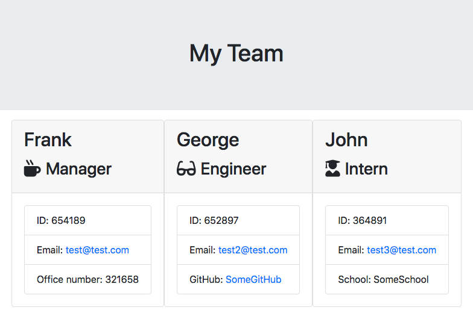

# Employee Summary Template Engine

  

  ## Description

  The greatest application known to man since the concept of writing something down. Finally, with one application, you can create a team consisting of Managers, Engineers, and Interns and display that information as an html file by simply installing several node.js packages via command line.

  

  [Demo Video](https://drive.google.com/file/d/1M-QdCmjJG1TcLmnH0agcNooUMqfYq3tV/view?usp=sharing)

  ## Table of Contents

  * [Usage](#usage)

  * [License](#license)

  * [Contributing](#contributing)

  * [Tests](#tests)

  * [Questions](#questions)

  ## Installation

  Running npm install is required before running app.js.

  ## Usage

  Nothing.

  ## License

  
  (https://opensource.org/licenses/MIT)

  ## Contributing

  Don't.

  ## Tests

  npm test is used to run tests.

  ## Questions

  Have a question? Email me directly at chadgtbootcamp@gmail.com.
  Check out my other projects at [chadfromspace](https://github.com/chadfromspace)